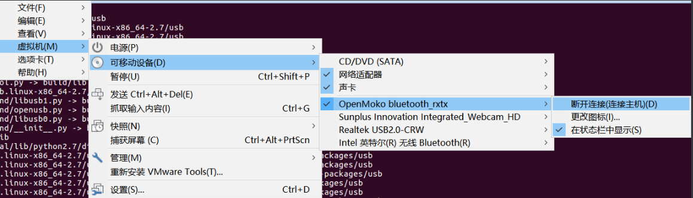

[TOC]


​       蓝牙是一种无线通信标准，工作在2.4GHz的ISM频段，用于短距离的数据连接，可以建立PAN网络，应用：手机配合使用蓝牙耳机，手机连接汽车音响，蓝牙键盘。

##  蓝牙技术简介

​       Bluetooth名字的来源是，蓝牙技术开发者Kardach当时正在读一本名为The Long Ships的小说，讲述的是Harald Bluetooth国王统一王国的故事，他觉得蓝牙把各种设备连接在一起，就像这位国王统一王国一样。

蓝牙的logo是符号文字*（Hagall）和B（Bjarkan）的组合，就是国王的名字Hagall Bjarkan的首字母。


蓝牙工作在2.4~2.485GHz，一共有79个频道，每个频道占据1MHz，蓝牙采用跳频的扩频技术，一秒钟跳跃1600次。

BLE（BlueTooth Low Energy）只有49个频道，每个频道占据2MHz带宽。

BLE主打功能是快速搜索，快速连接，超低功耗保持连接和传输数据，弱点是数据传输速率低，由于BLE的低功耗特点，因此普遍用于穿戴设备。

蓝牙是一种基于数据包通信的协议，使用的是主从式的网络结构，在一个piconet中，一个主节点可以和多达七个从节点通信。

蓝牙4.0版本引入了BLE协议，低功耗蓝牙的功耗非常低，可以使设备电池维持很长时间，可以在可穿戴设备中应用。

蓝牙可WiFi有很多相似之处，WiFi主要用于高速无线连接，传输距离更远；WiFi以接入点为中心，是一种客户端-服务器的结构，所有流量都通过接入点转发；蓝牙的应用场景是两个设备之间的点对点连接，是一种对称结构。

传统蓝牙数据传输速率小于 3Mbps，典型数据传输距离为 2-10m，蓝牙技术的典型应用是在两部手机之间进行小量数据的传输。

WIFI 最高数据传输速率可达 50Mbps，典型数据传输距离在 30-100m，WIFI 技术提供了一种 Intemet 的无线接入技术。

##  蓝牙安全概述

蓝牙协议有自己的加密和鉴权功能，蓝牙的秘钥产生是基于蓝牙的PIN码，PIN码一般都已经被写入到了设备中。

蓝牙主要的安全风险是：拒绝服务攻击，窃听，中间人攻击，数据篡改等。


##  蓝牙嗅探工具Ubertooth

Ubertooth是用于蓝牙嗅探的开源硬件，价格大约在120美元。

###  Ubertooth软件安装

Ubertooth源码在github上，地址是：https://github.com/greatscottgadgets/ubertooth

安装Ubertooth之前需要先安装一些依赖库：

```
─birdpwn@ubuntu ~ 
╰─$ sudo apt-get install cmake libusb-1.0-0-dev make gcc g++ libbluetooth-dev pkg-config libpcap-dev python-numpy python-pyside python-qt
```

```
sudo apt-get install libusb-1.0-0-dev make gcc pyside-tools python-numpy
```

从资料库里下载PyUSB，在根文件夹解压缩，然后找到新文件夹编译/安装python USB的支持文件。

```shell
wget http://sourceforge.net/projects/pyusb/files/PyUSB%201.0/1.0.0-alpha-3/pyusb-1.0.0a3.tar.gz/download -O pyusb-1.0.0a3.tar.gz
tar xvf pyusb-1.0.0a3.tar.gz
cd pyusb-1.0.0a3
sudo python setup.py install
```

然后编译安装libbtbb，这是一个蓝牙基带协议程序，一些ubertooth需要的蓝牙数据包基本解码文件，源码在github上

```http
╭─birdpwn@ubuntu ~ 
╰─$ git clone https://github.com/greatscottgadgets/libbtbb.git                                                                            
Cloning into 'libbtbb'...
remote: Enumerating objects: 1760, done.
remote: Total 1760 (delta 0), reused 0 (delta 0), pack-reused 1760
Receiving objects: 100% (1760/1760), 577.60 KiB | 364.00 KiB/s, done.
Resolving deltas: 100% (1074/1074), done.
Checking connectivity... done.
```

```http
╭─birdpwn@ubuntu ~ 
╰─$ cd libbtbb 
╭─birdpwn@ubuntu ~/libbtbb ‹master› 
╰─$ ls
changelog  cmake  CMakeLists.txt  lib  LICENSE  packaging  python  README.cmake  README.md  tests  web  wireshark
╭─birdpwn@ubuntu ~/libbtbb ‹master› 
╰─$ mkdir build
╭─birdpwn@ubuntu ~/libbtbb ‹master› 
╰─$ cd build 
╭─birdpwn@ubuntu ~/libbtbb/build ‹master› 
╰─$ cmake ..
-- The C compiler identification is GNU 5.4.0
-- The CXX compiler identification is GNU 5.4.0
-- Check for working C compiler: /usr/bin/cc
-- Check for working C compiler: /usr/bin/cc -- works
-- Detecting C compiler ABI info
-- Detecting C compiler ABI info - done
-- Detecting C compile features
-- Detecting C compile features - done
-- Check for working CXX compiler: /usr/bin/c++
-- Check for working CXX compiler: /usr/bin/c++ -- works
-- Detecting CXX compiler ABI info
-- Detecting CXX compiler ABI info - done
-- Detecting CXX compile features
-- Detecting CXX compile features - done
-- Setting version string git-6c7b9ff
-- Building shared library
-- Found PythonInterp: /usr/bin/python (found version "2.7.12") 
-- Configuring done
-- Generating done
-- Build files have been written to: /home/giantbranch/libbtbb/build
╭─birdpwn@ubuntu ~/libbtbb/build ‹master› 
╰─$ make
Scanning dependencies of target btbb
[ 11%] Building C object lib/src/CMakeFiles/btbb.dir/bluetooth_packet.c.o
[ 22%] Building C object lib/src/CMakeFiles/btbb.dir/bluetooth_piconet.c.o
[ 33%] Building C object lib/src/CMakeFiles/btbb.dir/bluetooth_le_packet.c.o
[ 44%] Building C object lib/src/CMakeFiles/btbb.dir/companies.c.o
[ 55%] Building C object lib/src/CMakeFiles/btbb.dir/pcap.c.o
[ 66%] Building C object lib/src/CMakeFiles/btbb.dir/pcapng.c.o
[ 77%] Building C object lib/src/CMakeFiles/btbb.dir/pcapng-bt.c.o
[ 88%] Linking C shared library libbtbb.so
[ 88%] Built target btbb
Scanning dependencies of target pcapdump
[100%] Generating build/timestamp
running build
running build_py
creating build
creating build/lib.linux-x86_64-2.7
creating build/lib.linux-x86_64-2.7/pcapdump
copying /home/giantbranch/libbtbb/python/pcaptools/pcapdump/__init__.py -> build/lib.linux-x86_64-2.7/pcapdump
copying /home/giantbranch/libbtbb/python/pcaptools/pcapdump/pcapdump.py -> build/lib.linux-x86_64-2.7/pcapdump
[100%] Built target pcapdump
Scanning dependencies of target btaptap
[100%] Built target btaptap
╭─birdpwn@ubuntu ~/libbtbb/build ‹master› 
╰─$ sudo make install
[ 88%] Built target btbb
[100%] Built target pcapdump
[100%] Built target btaptap
Install the project...
-- Install configuration: ""
-- Installing: /usr/local/lib/pkgconfig/libbtbb.pc
-- Installing: /usr/local/lib/libbtbb.so.1.0
-- Installing: /usr/local/lib/libbtbb.so.1
-- Installing: /usr/local/lib/libbtbb.so
-- Installing: /usr/local/include/btbb.h
running build
running build_py
running install
running install_lib
creating //usr/local/lib/python2.7/site-packages/pcapdump
copying /home/giantbranch/libbtbb/build/python/pcaptools/build/lib.linux-x86_64-2.7/pcapdump/__init__.py -> //usr/local/lib/python2.7/site-packages/pcapdump
copying /home/giantbranch/libbtbb/build/python/pcaptools/build/lib.linux-x86_64-2.7/pcapdump/pcapdump.py -> //usr/local/lib/python2.7/site-packages/pcapdump
byte-compiling //usr/local/lib/python2.7/site-packages/pcapdump/__init__.py to __init__.pyc
byte-compiling //usr/local/lib/python2.7/site-packages/pcapdump/pcapdump.py to pcapdump.pyc
running install_egg_info
Writing //usr/local/lib/python2.7/site-packages/pcapdump-0.0.0-py2.7.egg-info
-- Installing: /usr/local/bin/btaptap
```

另一种安装方式

```
wget https://github.com/greatscottgadgets/libbtbb/archive/2015-09-R2.tar.gz -O libbtbb-2015-09-R2.tar.gz
tar xf libbtbb-2015-09-R2.tar.gz
cd libbtbb-2015-09-R2
mkdir build
cd build
cmake ..
make
sudo make install
```

安装用于蓝牙嗅探的工具软件ubertooth：

```
wget https://github.com/greatscottgadgets/ubertooth/releases/download/2015-09-R2/ubertooth-2015-09-R2.tar.xz -O ubertooth-2015-09-R2.tar.xz
tar xf ubertooth-2015-09-R2.tar.xz
cd ubertooth-2015-09-R2/host
mkdir build
cd build
cmake ..
make
sudo make install
sudo ldconfig
```

安装wireshark

```
1. 安装wireshark
$ sudo apt install wireshark

或者ubuntu software中心搜索安装

2. 配置wireshark
$ sudo dpkg-reconfigure wireshark-common

选择yes，非root用户也能抓包

3.  安装完成之后查看用户组，查看已创建wireshark用户组
$ cat /etc/group |grep wireshark

wireshark:x:129:

4. 把当前登录用户加入到wireshark组中
$ sudo usermod -a -G wireshark $USER
wireshark:x:129:<当前登录用户>

5. 运行wireshark（可多开）
$ wireshark
```

安装kismet之前，我们需要先检查我们的所有软件是否可以使用。现在，我们来测试一下Ubertooth的频谱分析功能。

> 把ubertooth one连接到你的USB端口
>
> 如果您使用的是虚拟机，让你的虚拟机在设备/ USB端口上运行并搜索ubertooth one



如果你选择了ubertooth one启动，你必须让[三个LED灯](http://ubertooth.sourceforge.net/hardware/one/)亮起来。其中两个绿色的LED（RST和1.8V）都亮说明Ubertooth成功插在了你的主机上，红色LED（USB LED）亮了表示Ubertooth可以通过USB端口进行通讯了。


进入ubertooth-one-firmware-bin 目录，插上硬件升级固件

```
╭─birdpwn@ubuntu ~/ubertooth-2015-09-R2/ubertooth-one-firmware-bin 
╰─$ sudo ubertooth-dfu -d bluetooth_rxtx.dfu -r                                                                                                                                                         1 ↵
libUSB Error: Command Error:  (-1)
Switching to DFU mode...
Checking firmware signature
.......................................................................................................................................
Detached
```

回车后就可以进入DFU模式了，写入固件重新连接一下就可以进入正常模式

现在启动在specan_ui文件夹或ubertooth工具中找到的ubertooth的频谱分析器：

```
╭─birdpwn@ubuntu ~ 
╰─$ cd /home/giantbranch/ubertooth-2015-09-R2/host/python/specan_ui
╭─birdpwn@ubuntu ~/ubertooth-2015-09-R2/host/python/specan_ui 
╰─$ ls      
build           README    setup.py.in  ubertooth-specan-ui
CMakeLists.txt  setup.py  specan
╭─birdpwn@ubuntu ~/ubertooth-2015-09-R2/host/python/specan_ui 
╰─$ ./ubertooth-specan-ui 
```

你现在可以看到2.4GHz WIFI的频谱图


其他一些工具

```
─birdpwn@ubuntu ~/ubertooth-2015-09-R2/host/ubertooth-tools 
╰─$ cd /home/giantbranch/ubertooth-2015-09-R2/host/build/ubertooth-tools/src                                                                                                                            1 ↵
╭─birdpwn@ubuntu ~/ubertooth-2015-09-R2/host/build/ubertooth-tools/src 
╰─$ ls
CMakeFiles  cmake_install.cmake  Makefile  ubertooth-btle  ubertooth-debug  ubertooth-dfu  ubertooth-dump  ubertooth-ego  ubertooth-follow  ubertooth-rx  ubertooth-scan  ubertooth-specan  ubertooth-util
```

安装kismet

```
sudo apt-get install libncurses-dev
wget https://kismetwireless.net/code/kismet-2013-03-R1b.tar.xz
tar xf kismet-2013-03-R1b.tar.xz
cd kismet-2013-03-R1b
ln -s ../ubertooth-2015-09-R2/host/kismet/plugin-ubertooth .
./configure
make && make plugins
sudo make suidinstall
sudo make plugins-install
```

安装BLE解密工具crackle([开源项目地址](https://github.com/mikeryan/crackle))

```
git clone https://github.com/mikeryan/crackle.git
cd crackle
make
make install
```

###  使用Ubertooth

Ubertooth其实是一个开发平台，可以编写代码满足自己的需求，刚刚使用的话，用硬件中的一些现成小工具做一些简单实验。

####   频谱分析

使用Ubertooth观察频谱，Ubertooth插在电脑上，RST和1V8两个灯会亮起来，RST灯表示微控制器已经运行，1V8灯表示CC2400芯片已经上电，使用Linux系统，红色USB灯也会亮起来。

host/python/specan_ui目录下运行“./ubertooth-specan-ui ”就可以看到2.4GHz频段信号频谱。

现在可以看到2.4GHz WIFI的频谱图


####  侦听LAP地址

蓝牙数据包的开头部分是LAP（Lower Address Part）地址，LAP地址是蓝牙设备地址（BD_ADDR）的低位部分，BD_ADDR是48bit的地址，LAP是BD_ADDR的低位部分24bit，LAP地址在每个数据包中都会被发送，最重要的就是侦听LAP地址，通过LAP地址就可以知道附近有哪些蓝牙设备。

在Ubertooth中已经包含了可执行程序：

####  Kismet

更加高级的蓝牙侦听，就需要通过Kismet来实现了，Kimset是侦听802.11系统的一个著名软件，Ubertooth为kimset

写了一个插件，这样就可以用Kimset来分析蓝牙数据包了。

Limset不仅可以标记出LAP地址，还可以标记处更高的8bit地址（UAP），这是分析多个数据包解码得到的，Kimset可以把解码后的数据包保存为pcapbtbb文件，这样就可以用wireshark来分析了。

一些商用的WiFi监控软件也有蓝牙监控功能，就是用Kimset+Ubertooth这样的方式实现的。

kismet是一个通过WiFi A/ B / G / N的2.4GHz的网络来进行嗅探和入侵分析的无线探测器。我们首先在Ubuntu上以默认选项安装kismet，然后安装ubertooth捕捉蓝牙数据包进行分析的插件。安装kismet的命令：

```
sudo apt-get install libpcap0.8-dev libcap-dev pkg-config \
build-essential libnl-dev libncurses-dev libpcre3-dev \
libpcap-dev libcap-dev
wget http://www.kismetwireless.net/code/kismet-2011-03-R2.tar.gz
tar xf kismet-2011-03-R2.tar.gz
sudo mv kismet-2011-03-R2 /usr/src/kismet
ln -s ../ubertooth-2012-10-R1/host/kismet/plugin-ubertooth /usr/src/kismet
cd /usr/src/kismet
sudo ./configure
sudo make && sudo make plugins
sudo make suidinstall
sudo make plugins-install
```


在/ usr / local / etc中的kismet.conf文件，添加扩展名pcapbtbb：

```
cd /usr/local/etc

gedit kismet.conf

找到logtypes行

在最后添加“pcapbtbb”以确保kismet为之后的分析记录了蓝牙文件

通过“grep logtypes kismet.conf“验证
```


根据下面的步骤操作编译并安装Kismet插件捕获蓝牙数据包：

```
cd /ubertooth-2015-09-R2/host/kismet/plugin-ubertooth 
KIS_SRC_DIR=/usr/src/kismet make 
sudo KIS_SRC_DIR=/usr/src/kismet make install
```


```
kismet插件安装完毕，让我们启动kismet然后配置ubertooth插件。做下面的步骤：

开始Kismet：sudo kismet

选择“YES”显示默认颜色

确认你是在以root身份运行后，按OK

当再次提示，确认“YES”开始kismet服务

按Enter键启动服务器

因为控制台窗口里显示的只有信息，所以可以关掉了

提示添加接口，就选择“YES”。

当添加资源的窗口打开，在“INTF”字段后填上“ubertooth”，并在“Name”后面也填上“ubertooth”，然后单击添加

转至工具栏并转到Kismet/Plugins/Select Plugin…

将箭头向上指向“ubertooth_ui.so”，然后点击空格键启用ubertooth，然后单击关闭

关闭窗口，验证ubertooth在上面

启用蓝牙设备寻找模式/扫描，耐心等待几秒钟，你会看到捕获的数据包

完成捕获后在提示下杀掉服务关闭kismet

你可以查看一下你的工作目录，kismet会记录pcapbtbb和其他文件，我们使用Wireshark来分析并Wireshark的ubertooth插件
```


安装Wireshark分析kismet捕获的文件。

```
sudo apt-get install wireshark wireshark-dev \
libwireshark1 libwireshark-dev cmake
cd libbtbb-2012-10-R3/wireshark/plugins/btbb
cmake -DCMAKE_INSTALL_LIBDIR=/usr/lib/wireshark/libwireshark1/plugins .
make
sudo make install
```


####  嗅探扫描

```
╭─birdpwn@ubuntu ~/ubertooth-2015-09-R2/host/build/ubertooth-tools/src 
╰─$ ls                                                                                             
CMakeFiles  cmake_install.cmake  Makefile  ubertooth-btle  ubertooth-debug  ubertooth-dfu  ubertooth-dump  ubertooth-ego  ubertooth-follow  ubertooth-rx  ubertooth-scan  ubertooth-specan  ubertooth-util
```

**ubertooth-scan**


**ubertooth-btle**

```
ubertooth-btle -f -c test.pcap
```

使用这条命令我们可以把设备捕获到的数据包保存到本地，完成后可导入wireshark进行数据包、协议分析。

wireshark导入嗅探到的蓝牙数据包需要处理一下才能正常查看，不然无法正常分析数据：


Edit → Preferences → Protocols → DLT_USER → Edit → New

在payload protocol中输入btle


使用规则过滤数据包：参考[Capturing BLE in Wireshark](https://github.com/greatscottgadgets/ubertooth/wiki/Capturing-BLE-in-Wireshark)

```
btle.data_header.length > 0 || btle.advertising_header.pdu_type == 0x05
```


##  低功耗蓝牙（BLE）

蓝牙无线技术是使用范围最广泛的全球短距离无线标准之一，全新的蓝牙 4.0 版本将传统蓝牙，高速蓝牙和低功耗蓝牙技术三种蓝牙技术合而为一。它集成了蓝牙技术在无线连接上的固有优势，同时增加了高速蓝牙和低功耗蓝牙的特点，这三个规格可以组合使用，也可以单独使用，低功耗蓝牙即 ble 是蓝牙 4.0 的核心规范，该技术最大特点是拥有超低的运行功耗和待机功耗，蓝牙低功耗设备使用一粒纽扣电池可以连续工作数年之久，可应用与对成本和功耗都有严格要求的无线方案，而且随之智能机的发展将有着更加广泛的领域。

在智能硬件破解中，经常可以看到BLE的破解例子。

Ubertooth也支持BLE监听，但是更加常用的是BLE Sniffer，使用CC2540 USB dongle实现。

BLE分为三部分Service、Characteristic、Descriptor，这三部分都由UUID作为唯一标示符。一个蓝牙4.0的终端可以包含多个Service，一个Service可以包含多个Characteristic，一个Characteristic包含一个Value和多个Descriptor，一个Descriptor包含一个Value。

> BLE 规范中定义了 GAP（Generic Access Profile）和 GATT（Generic Attribute）两个基本配置文件。
>
> **GAP 层**负责设备访问模式和进程，包括设备发现，建立连接，终止连接。初始化安全特征和设备配置。
>
> **GATT 层**用于已连接的蓝牙设备之间的数据通信。

**BLE特点&优势**

**1.2.1高可靠性**

对于无线通信而言，由于电磁波在传输过程中容易受很多因素的干扰，例如，障碍物的阻挡、天气状况等，因此，无线通信系统在数据传输过程中具有内在的不可靠性。蓝牙技术联盟 SIG 在指定蓝牙 4.0 规范时已经考虑到了这种数据传输过程中的内在的不确定性，在射频，基带协议，链路管理协议中采用可靠性措施，包括：差错检测和矫正，进行数据编解码，数据降噪等，极大地提高了蓝牙无线数据传输的可靠性，另外，使用自适应调频技术，能最大程度地减少和其他 2.4G 无线电波的串扰。

**1.2.2 低成本、低功耗**

低功耗蓝牙支持两种部署方式：双模式和单模式，一般智能机上采用双模式，外设一般采用 BLE 单模。

BLE 技术可以应用于 8-bit MCU， 目前 TI 公司推出的兼容 BluetoothLE 协议的 SoC芯片 CC254X 每片价格在 7.6 元左右， 外接几个阻容器件构成的滤波电路和 PCB 天线即可实现网络节点的构建。Nodic的NRF51822也不过才10元人民币。

低功耗设计：蓝牙 4.0 版本强化了蓝牙在数据传输上的低功耗性能，功耗较传统蓝牙降低了 90%。

> **传统蓝牙设备**的待机耗电量一直是其缺陷之一，这与传统蓝牙技术采用16至32个频道进行广播有很大关系，而低功耗蓝牙仅适用 3个广播通道，且每次广播时射频的开启时间也有传统的 22.5ms 减少到 0.6~1.2ms，这两个协议规范的改变，大幅降低了因为广播数据导致的待机功耗。
>
> **低功耗蓝牙**设计用深度睡眠状态来替换传统蓝牙的空闲状态，在深度睡眠状态下，主机 Host 长时间处于超低的负载循环 Duty Cycle 状态，只在需要运作时由控制器来启动，由于主机较控制器消耗的能源更多，因此这样的设计也节省了更多的能源。

**1.2.3 快速启动、瞬间连接**

此前蓝牙版本的启动速度非常缓慢，2.1 版本的蓝牙启动连接需要 6s 时间，而蓝牙4.0 版本仅需要 3ms 即可完成，几乎是瞬间连接。

**1.2.4 传输距离极大提供**

传统蓝牙传输距离一般 2-10m，而蓝牙 4.0 的有效传输距离可以达到 60~100m，传输距离提升了 10 倍，极大开拓了蓝牙技术的应用前景。

**1.2.5 高安全性**

为了保证数据传输的安全性，使用 AES-128 CCM 加密算法进行数据包加密认证，对于初学阶段，安全性问题可以暂时不考虑。

###  BLE协议栈分析

一、概述

1、BLE蓝牙协议栈结构


BLE蓝牙协议栈结构图

分为两部分：控制器和主机。对于4.0以前的蓝牙，这两部分是分开的。所有profile（姑且称为剧本吧，用来定义设备或组件的角色）和应用都建构在GAP或GATT之上。下面由结构图的底层组件开始介绍。 

 PHY层，**工作车间**，1Mbps自适应跳频GFSK（高斯频移键控），运行在免证的2.4GHz

LL层为RF控制器，**控制室**，控制设备处于准备（standby）、广播、监听/扫描（scan）、初始化、连接，这五种状态中一种。五种状态切换描述为：未连接时，设备广播信息（向周围邻居讲“我来了”），另外一个设备一直监听或按需扫描（看看有没有街坊邻居家常里短可聊，打招呼“哈，你来啦”），两个设备连接初始化（搬几把椅子到院子），设备连接上了（开聊）。发起聊天的设备为主设备，接受聊天的设备为从设备，同一次聊天只能有一个意见领袖，即主设备和从设备不能切换。

HCI层，为接口层，**通信部**，向上为主机提供软件应用程序接口（API），对外为外部硬件控制接口，可以通过串口、SPI、USB来实现设备控制。

 L2CAP层，**物流部**，行李打包盒拆封处，提供数据封装服务

SM层，**保卫处**，提供配对和密匙分发，实现安全连接和数据交换

ATT层，**库房**，负责数据检索

 GATT层，**出纳/库房前台**，出纳负责处理向上与应用打交道，而库房前台负责向下把检索任务子进程交给ATT库房去做，其关键工作是把为检索工作提供合适的profile结构，而profile由检索关键词（characteristics）组成。

 GAP层，**秘书处**，对上级，提供应用程序接口，对下级，管理各级职能部门，尤其是指示LL层控制室五种状态切换，指导保卫处做好机要工作。

TI的这款CC2540器件可以单芯片实现BLE蓝牙协议栈结构图的所有组件，包括应用程序。

2、任务调度---OSAL操作系统抽象层

正如一个公司为了实现扩大产能和产品多样化，建立了多个办公室和工厂一样，蓝牙为了实现同多个设备相连，或实现多功能，也实现了功能扩充，这就产生了调度问题。因为，虽然软件和协议栈可扩充，但终究最底层的执行部门只有一个。

为了实现多事件和多任务切换，需要把事件和任务对应的应用，以及其相关的提供支撑“办公室”和“工厂”打包起来，并起一个名字OSAL操作系统抽象层，类似于集团公司以下的**子公司**。

3、设备改造---HAL硬件抽象层

如果实现软件和硬件的低耦合，使软件不经改动或很少改动即可应用在另外的硬件上，这样就方便硬件改造、升级、迁移后，软件的移植。HAL硬件抽象层正是用来抽象各种硬件的资源，告知给软件。其作用类似于嵌入式系统设备驱动的定义硬件资源的h头文件。其角色类似于现代工厂的**设备管理部**。

4、BLE低功耗蓝牙系统架构


BLE低功耗蓝牙系统架构图，图中的Task用附图6BLE蓝牙协议栈结构图来描述

BLE低功耗蓝牙软件有2个主要组成： OSAL操作系统抽象层和 HAL硬件抽象层，多个Task任务和事件在OSAL管理下工作，而每个任务和事件又包括3个组成：BLE 协议栈，profiles和应用程序。

同样可以用现代工厂模式来类比


BLE低功耗蓝牙软件5个主要组成用现代工厂架构来类比。

有了上面的简介，下面对OSAL、HAL和BLE进行稍微深入的介绍。

二、OSAL操作系统抽象层

1、软件功能由OSAL管理下的事件来实现

OSAL作为调度核心，BLE协议栈、profile定义、所有的应用都围绕它来实现。OSAL不是传统大家使用的操作系统，而是一个允许软件建立和执行事件的循环。

软件功能是由任务事件来实现的，创建一个任务事件需要以下工作：

创建task identifier任务ID；

编写任务初始化（task initialization routine）进程，并需要添加到OSAL初始化进程中，这就是说系统启动后不能动态添加功能；

编写任务处理程序；

如有需要提供消息服务。

BLE协议栈的各层都是以OSAL任务方式实现，由于LL控制室的时间要求最为迫切，所以其任务优先级最高。为了实现任务管理，OSAL通过消息处理（messageprocess），存储管理，计时器定时等附加服务实现。

2、系统启动流程

为了使用OSAL，在main函数的最后要启动一个名叫osal_start_system的进程，该进程会调用由特定应用决定的启动函数osalInitTasks（来启动系统）。osalInitTasks逐个调用BLE协议栈各层的启动进程来初始化协议栈。随后，设置一个任务的8bit任务ID（task ID），跳入循环等待执行任务，系统启动完成。

3、任务事件与事件处理

**进程优先级和任务ID**

 任务优先级决定于任务ID，任务ID越小，优先级越高

BLE协议栈各层的任务优先级比应用程序的高

 初始化协议栈后，越早调入的任务，任务ID越高，优先级越低，即系统倾向于处理新到的任务

**事件变量和旗语**

每个事件任务由对应的16bit事件变量来标示，事件状态由旗号（taskflag）来标示。如果事件处理程序已经完成，但其旗号并没有移除，OSAL会认为事情还没有完成而继续在该程序中不返回。比如，在SimpleBLEPeripheral实例工程中，当事件START_DEVICE_EVT发生，其处理函数SimpleBLEPeripheral_ProcessEvent就运行，结束后返回16bit事件变量，并清除旗语SBP_START_DEVICE_EVT。

**事件处理表单**

每当OSAL事件检测到了有任务事件，其相应的处理进程将被添加到由处理进程指针构成的事件处理表单中，该表单名叫taskArr（taskarray）。taskArr中各个事件进程的顺序和osalInitTasks初始化函数中任务ID的顺序是对应的。

**事件调度的方法**

有两种，最简单的方法是使用osal_set_event函数（函数原型在OSAL.h文件中），在这个函数中，用户可以像定义函数参数一样设置任务ID和事件旗语。第二种方法是使用osal_start_timerEx函数（函数原型在OSAL_Timers.h文件中），使用方法同osal_set_event函数，而第三个以毫秒为单位的参数osal_start_timerEx则指示该事件处理必须要在这个限定时间内，通过定时器来为事件处理计时。

4、存储管理

类似于Linux嵌入式系统内存分配C函数mem_alloc，OSAL利用osal_mem_alloc提供基本的存储管理，但osal_mem_alloc只有一个用于定义byte数的参数。对应的内存释放函数为osal_mem_free。

5、进程间通信—通过消息机制实现

不同的子系统通过OSAL的消息机制通信。消息即为数据，数据种类和长度都不限定。

消息收发过程描述如下：

接收信息，调用函数osal_msg_allocate创建消息占用内存空间（已经包含了osal_mem_alloc函数功能），需要为该函数指定空间大小，该函数返回内存空间地址指针，利用该指针就可把所需数据拷贝到该空间。

发送数据，调用函数osal_msg_send，需为该函数指定发送目标任务，OSAL通过旗语SYS_EVENT_MSG告知目标任务，目标任务的处理函数调用osal_msg_receive来接收发来的数据。建议每个OSAL任务都有一个消息处理函数，每当任务收到一个消息后，通过消息的种类来确定需要本任务做相应处理。消息接收并处理完成，调用函数osal_msg_deallocate来释放内存（已经包含了osal_mem_free函数功能）。

三、硬件抽象层HAL

当新的硬件平台做好后，只需修改HAL，而不需修改HAL之上的协议栈的其他组件和应用程序。

四、BLE低功耗蓝牙协议栈

1、BLE库文件

TI蓝牙协议栈是以单独一个库文件提供的，并没有提供源代码，因此不做深入说明。对于TI的BLE实例应用，这个单独库文件已经够用，列出了所有的库文件。


附图9 BLE库文件

由于GAP和GATT与用户程序直接交互，因此下文对库文件中GAP和GATT一一讲解。

2、GAP秘书处

2.1角色（即服务，功能）

GAP运行在如下四种角色的一种：

Broadcaster    广播员—我在，但只可远观，不可连接。

 Observer      观察员—看看谁在，但我只远观，不连接。

Peripheral       外设（从机）—我在，谁要我就跟谁走，协议栈单层连接。

 Central           核心（主机）—看看谁在，并且愿意跟我走我就带她/他走，协议栈单层或多层连接，目前最多支持3个同时连接。

虽然指标显示BLE可以同时扮演多个角色，但是在TI提供的BLE实例应用中缺省只支持外设角色。每一种角色都由一个剧本（roleprofile）来定义。

2.2连接

**主从机连接过程**

一个典型的低功耗蓝牙系统同时包含外设和核心（主机），两者的连接过程如下：

外设角色向外发送自己的信息（设备地址、名字等），主机收到外设广播信息后，发送扫描请求（scanrequest）给外设，外设响应主机的请求，连接建立完成。

**连接参数**

主要有通信间隙（connectioninterval）、外设鄙视(slavelatency)、最大耐心等待时间（supervisiontimeout）等，下面简单说明。

通信间隙—蓝牙通信是间断的、跳频的，每次连接都可能选择不同的子频带。跳频的好处是避免频道拥塞，间断连接的好处是节省功耗，通信间隙就是指两次连接之间的时间间隔。这个间隔以1.25ms为基本单位，最小6单位最大3200单位，间隙越小通信越及时，间隙越大功耗越低。

外设鄙视—外设与主机建立连接以后，没事的时候主机总会定期发送问候信息到外设，外设懒得搭理，这些主机发送的信息就浮云般飘过。可以忽略的连接事件个数从0到499个，最多不超过32秒。有效连接间隙= 连接间隙x （1+ 外设鄙视）.

最大耐心等待时间—指的是为了创建一个连接，主机允许的最大等候时间，在这个时间内，不停的尝试连接。范围是10个~3200个通信间隙基本单位（1.25ms）。

以上三参数大小设置优劣是显而易见的，在此也飘过。连接参数的设置请参看后文“5.1GAP外设剧本”小节。

**连接异常处理**

举例说明连接异常，如主机采用从机并不舒坦的参数来请求连接，有如主从机已经连接了，但从机有想法了，要改参数条约。通过“连接参数更新请求（ConnectionParameter Update Request）”来解决问题，交由L2CAP“收发室物流处”处理。连接参数上文已经说了，不再叙述。

**加密处理**

利用配对实现，利用密匙来加密授权连接。典型的过程是：外设向主机请求口令一个（passkey）以便进行配对，待主机发送了正确的口令之后，连接通信通过主从机互换密码来校验。由于蓝牙通信是间断通信，如果一个应用需要经常通信，而每次通信都要重新申请连接，那将是劳神费力的，为此GAP安全卫士（SM,security profile）提供了一种长期签证（long-termset of keys），叫做绑定（bonding），这样每次建立连接通关流程就简便快捷了。

3、出纳GATT

GATT负责两个设备间通信的数据交互。共有两种角色：出纳员（GATTClient）和银行（GATTServer），银行提供资金，出纳从银行存取款。银行可以同时面对多个出纳员。这两种角色和主从机等角色是无关的。

GATT把工作拆分成几部分来实现：读关键词（CharacteristicValue）和描述符（CharacteristicDescriptor），用来去库房查找提取数据。写读关键词和描述符。

GATT银行（GATTServer）的业务部门（API）主要提供两个主要的功能：一是服务功能，注册或销毁服务（serviceattribute），并作为回调函数（callbackfunction）；二是管理功能，添加或删除GATT银行业务。

一个角色定义的剧本可以同时定义多个角色，每个角色的服务、关键词、关键值、描述符（service,characteristic, characteristic value and descriptors）都以句柄（attributes）形式保存在角色提供的服务上。所有的服务都是一个gattAttribute_t类型的array，在文件gatt.h.中定义。

4、调用GAP和GATT的一般过程

 API调用

协议栈响应并返回

 协议栈发送一个OSAL消息（数据）去调用相应任务事件

调用任务去接收和处理消息

消息清除

以设备初始化为GAP外设角色来举例说明，外设角色由其剧本（GAPperipheral role profile）来决定，实例程序在文件peripheral.c内。

调用API函数GAP_DeviceInit。

GAP检查了一下说，好，可以初始化，返回值为SUCCESS (0x00)，并通知BLE干活。

 BLE协议栈发送OSAL消息给外设角色剧本（peripheral roleprofile），消息内容包括要干什么（eventvalue）GAP_MSG_EVENT和指标是什么（opcodevalue，参数）。

角色剧本的服务任务就收到了事件请求SYS_EVENT_MSG，表示有消息来了。

角色剧本接收消息，并拆看到底是什么事，接着把消息数据转换（cast）成具体要干事情，并完成相应的工作（这里为gapDeviceInitDoneEvent_t）。

角色剧本清除消息并返回。

再举一个例子：GATT客户端设备想从GATT服务器端读取数据，即GATT出纳想从GATT银行那边取点钱出来

应用程序调用GATT子进程API函数GATT_ReadCharValue，传递的参数为连接句柄、关键词句柄和自身任务的ID。

GATT答应了这个请求，返回值为SUCCESS (0x00)，向下告知BLE有活干了。

 BLE协议栈在下次建立蓝牙连接时，发送取钱的指令给银行，当银行说好，我们正好有柜员没事在干剪指甲，于是把钱取出来交给了BLE。

BLE接着就把取到的钱包成消息（OSAL message），通过出纳GATT返回给了应用程序。消息内包含GATT_MSG_EVENT和修改了的ATT_READ_RSP。

应用程序接收到了从OSAL来的SYS_EVENT_MSG事件，表示钱可能到了

应用程序接收消息，拆包检查，并把需要的钱拿走。

最后，应用程序把包装袋销毁，没事了，返回。

5、GAP角色剧本profiles

在TI的BLE实例应用中提供了3中GAP角色剧本，保卫处角色，和几种GATT出纳/库管示例程序服务角色。

5.1 GAP外设剧本

其API函数在peripheral.h中定义，包括：

 GAPROLE_ADVERT_ENABLED—广播使能。

GAPROLE_ADVERT_DATA—包含在广播里的信息。

GAPROLE_SCAN_RSP_DATA—外设用于回复主机扫描请求的信息。

GAPROLE_ADVERT_OFF_TIME—表示外设关闭广播持续时间，该值为零表示无限期关闭广播直到下一次广播使能信号到来。

GAPROLE_PARAM_UPDATE_ENABLE—使能自动更新连接参数，可以让外设连接失败时自动调整连接参数以便重新连接。

GAPROLE_MIN_CONN_INTERVAL—设置最小连接间隙，缺省值为80个单位（每单位1.25ms）。

GAPROLE_MIN_CONN_INTERVAL—设置最大连接间隙，缺省值为3200个单位。

GAPROLE_SLAVE_LATENCY—外设鄙视参数，缺省为零。

 GAPROLE_TIMEOUT_MULTIPLIER--最大耐心等待时间，缺省为1000个单位。

GAPRole_StartDevice函数用来初始化GAP外设角色，其唯一的参数是gapRolesCBs_t，这个参数是一个包含两个函数指针的结构体，这两函数是pfnStateChange和pfnRssiRead，前者标示状态，后者标示RSSI已经被读走了。

5.2 多角色同时扮演

前文5.1中设备配置为外设，这里以设备同时为外设和广播员两种角色。方法为：去除前文外设的定义剧本peripheral.c和peripheral.h，添加新的剧本peripheralBroadcaster.c和peripheralBroadcaster.h；定义处理器值（preprocessorvalue）PLUS_BROADCASTER。

5.3 GAP主机剧本

与外设剧本相似，主机剧本的API函数在central.h中定义，包括GAPCentralRole_GetParameter和GAPCentralRole_SetParameter以及其他。如GAPROLE_PARAM_UPDATE_ENABLE连接参数自动更新使能的功能，跟外设角色的一样。

GAPCentralRole_StartDevice函数用来初始化GAP主机角色，其唯一的参数是gapCentralRolesCBs_t,，这个参数是一个包含两个函数指针的结构体，这两函数是eventCB和rssiCB，每次GAP时间发生，前者都会被调用，后者标示RSSI已经被读走。

5.4 GAP绑定管理器剧本

用于保持长期的连接。同时支持外设配置和主机配置。当建立了配对连接后，如果绑定使能，绑定管理器就维护这个连接。主要参数有：GAPBOND_PAIRING_MODE，GAPBOND_MITM_PROTECTION，GAPBOND_IO_CAPABILITIES，GAPBOND_IO_CAP_DISPLAY_ONLY，GAPBOND_BONDING_ENABLED

GAPBondMgr_Register函数用来初始化GAP主机角色，其唯一的参数是gapBondCBs_t,，这个参数是一个包含两个函数指针的结构体，这两函数是pairStateCB和passcodeCB，前者返回状态，后者用于配对时产生6为数字口令（passcode）。

###  通信信道

BLE 工作在 ISM 频带，定义了两个频段，2.4GHz 频段和 896/915MHz 频带。在IEEE802.15.4 中共规定了 27 个信道：

> 在 2.4GHz 频段，共有 16 个信道，信道通信速率为 250kbps：
>
> 在 915MHz 频段，共有 10 个信道，信道通信速率为 40kbps：
>
> 在 868MHz 频段，有 1 个信道，信道通信速率为 20kbpS。

[](http://images2015.cnblogs.com/blog/640760/201606/640760-20160612132955824-30116257.png)

BLE 工作在 2.4GHz 频段，仅适用 3 个广播通道，适用所有蓝牙规范版本通用的自适应调频技术。

BlueTooth 有79个射频信道，按0-78排序，并于2402 MHz开始，以1 MHz分隔：

```
channel 00 : 2.402000000 Ghz
channel 01 : 2.403000000 Ghz
…
channel 78 : 2.480000000 Ghz
```

BTLE有40个频道（也称为信道），按37在第一个，后面由0-36，然后第39信道（那么38呢 :) ）第38信道位于10和11之间：

```
channel 37 : 2.402000000 Ghz
channel 00 : 2.404000000 Ghz
channel 01 : 2.406000000 Ghz
channel 02 : 2.408000000 Ghz
channel 03 : 2.410000000 Ghz
channel 04 : 2.412000000 Ghz
channel 05 : 2.414000000 Ghz
channel 06 : 2.416000000 Ghz
channel 07 : 2.418000000 Ghz
channel 08 : 2.420000000 Ghz
channel 09 : 2.422000000 Ghz
channel 10 : 2.424000000 Ghz
channel 38 : 2.426000000 Ghz
channel 11 : 2.428000000 Ghz
channel 12 : 2.430000000 Ghz
channel 13 : 2.432000000 Ghz
channel 14 : 2.434000000 Ghz
channel 15 : 2.436000000 Ghz
channel 16 : 2.438000000 Ghz
channel 17 : 2.440000000 Ghz
channel 18 : 2.442000000 Ghz
channel 19 : 2.444000000 Ghz
channel 20 : 2.446000000 Ghz
channel 21 : 2.448000000 Ghz
channel 22 : 2.450000000 Ghz
channel 23 : 2.452000000 Ghz
channel 24 : 2.454000000 Ghz
channel 25 : 2.456000000 Ghz
channel 26 : 2.458000000 Ghz
channel 27 : 2.460000000 Ghz
channel 28 : 2.462000000 Ghz
channel 29 : 2.464000000 Ghz
channel 30 : 2.466000000 Ghz
channel 31 : 2.468000000 Ghz
channel 32 : 2.470000000 Ghz
channel 33 : 2.472000000 Ghz
channel 34 : 2.474000000 Ghz
channel 35 : 2.476000000 Ghz
channel 36 : 2.478000000 Ghz
channel 39 : 2.480000000 Ghz
```

40个频道中:37、38、39为广播信道,另外37个频道用于数据的传输

###  TI BLE Sniffer

使用德州仪器（TI）CC2540蓝牙低功耗模块配合官方的SmartRF协议软件包监听器：PACKET-SNIFFER，可对三个蓝牙广播信道进行嗅探。

BLE Sniffer软件官网：http://processors.wiki.ti.com/index.php/BLE_Device_Monitor_User_Guide#Installation

BLE monitor下载地址：http://www.ti.com/lit/sw/swrc258q/swrc258q.zip

packet sniffer下载地址：http://www.ti.com.cn/tool/cn/packet-sniffer

需要一个CC2540 USB Dongle，在windows下安装好软件，插上Dongle打开软件


点击Start，进入Sniffer界面，选择Dongle设备


点击play就可以侦听BLE数据包了，可以侦听到很多广播数据包，除了广播包，Packet Sniffer还可以侦听其他数据包，在侦听的时候，如果遇到两个蓝牙设备正在建立连接，Packet Sniffer就会自动跟踪这个连接的跳频节奏，就可以侦听到这个连接的所有数据包。


这种建立连接很简单，一些秘钥信息会在中间传播，因此很多破解智能硬件的案例，都是使用Packet Sniffer 来分析连接建立的流程的。

###  基于HackRF嗅探蓝牙数据包

方法参考：BTLE packet sniffer based on HACKRF (function and performance similar to TI’s packet sniffer)](http://sdr-x.github.io/BTLE-SNIFFER/)

HackRF.NET 中文版：[基于HACKRF的低功耗蓝牙（BTLE）packet sniffer/scanner](http://www.hackrf.net/2015/11/btle-sniffer/)


安装HackRF驱动：

[https](https://github.com/mossmann/hackrf)： [//github.com/mossmann/hackrf](https://github.com/mossmann/hackrf)

HACKRF BTLE packet sniffer已经可以像TI（德州仪器）的一样，根据初始广播建链信息自动开始跟踪跳频数据信道！HACKRF切换时间很快，即使通过USB控制，也能达到几ms内完成（<8ms），有了一个开源的BTLE sniffer： <https://github.com/JiaoXianjun/BTLE>

BTLE是由Xianjun Jiao开发的免费开源蓝牙低功耗（BLE）软件套件。

包括：

- btle_rx - 一个完整的BLE嗅探器。除了嗅探广播/固定频道之外，它还可以跟踪通信链路的频道跳跃。
- btle_tx - 通用BLE数据包生成器。除了BLE标准外，它还支持原始位模式以生成任意GFSK数据包。

```
git clone https://github.com/JiaoXianjun/BTLE
cd BTLE/host
mkdir build
cd build
cmake ../                   (default. for HackRF)
cmake ../ -DUSE_BLADERF=1   (for bladeRF)
在上面的cmake中没有-DUSE_BLADERF = 1表示默认使用HACKRF
make
./btle-tools/src/btle_rx
btle_rx用法
btle_rx -c chan -g gain -a access_addr -k crc_init -v -r
-c chan 
```

和TI的packet sniffer建链跳频捕捉对比：


HACKRF BTLE sniffer 捕捉跟踪BTLE跳频链路的原理如图：


###  使用手机应用读写BLE设备属性

手机本身也是有BLE芯片的，一些手机APP是可以连接周围的BLE设备的，还可以对某些属性进行读写操作，Apple上有一个叫LightBlue的应用，Android上可以用BLEDeng。


通过LightBlue修改BLE的属性前提是，LightBl一般来说，如果攻击目标没有初始化，攻击者想要把连接抢过来是很困难的。

###  模拟BLE设备发射数据包

首先介绍一个开源的BTLE sniffer： <https://github.com/JiaoXianjun/BTLE>

BTLE是由Xianjun Jiao开发的免费开源蓝牙低功耗（BLE）软件套件。

这个项目中有收发包程序，先要安装HackRF的驱动：

https://github.com/mossmann/hackrf

然后编译安装：

```
git clone https://github.com/JiaoXianjun/BTLE
cd BTLE/host
mkdir build
cd build
cmake ../                   (default. for HackRF)
cmake ../ -DUSE_BLADERF=1   (for bladeRF)
在上面的cmake中没有-DUSE_BLADERF = 1表示默认使用HACKRF
make
./btle-tools/src/btle_rx
btle_rx用法
btle_rx -c chan -g gain -a access_addr -k crc_init -v -r
-c chan 
```

Ibeacon 是apple开发的基于BLE(Bluetooth low energy)的精确定位技术。常常用来做室内定位。

这里简单讲解下ibeacon的数据包格式，btle_tx示例

```
./btle-tools/src/btle_tx 37-iBeacon-AdvA-010203040506-UUID-B9407F30F5F8466EAFF925556B57FE6D-Major-0008-Minor-0009-TxPower-C5-Space-100     r100
```

上面的命令发送iBeacon数据包并以100ms的时间间隔重复100次。对应的描述符文件[BTLE / host / btle-tools / src / packets_ibeacon.txt](https://github.com/JiaoXianjun/BTLE/blob/master/host/btle-tools/src/packets_ibeacon.txt)。您可以使用BLE嗅探器加密狗来查看数据包。

包描述符字符串：

```
37-iBeacon-AdvA-010203040506-UUID-B9407F30F5F8466EAFF925556B57FE6D-Major-0008-Minor-0009-TxPower-C5-Space-100
37
```

第37频道（BTLE广告频道之一37 38 39）

```
iBeacon
```

包格式关键字，表示iBeacon格式。（实际上它是Core_V4.0.pdf中的ADV_IND格式）

```
AdvA
```

广告地址（MAC地址），设置为010203040506（参见Core_V4.0.pdf）

```
UUID
```

在这里我们将其指定为Estimote的固定UUID：B9407F30F5F8466EAFF925556B57FE6D

```
Major
```

主要数量的iBeacon格式。（这是0008）

```
Minor
```

次要数量的iBeacon格式。（这是0009）

```
Txpower
```

iBeacon格式的发射功率参数（这里是C5）

```
Space
```

发送此数据包后将等待多少毫秒。（这里是100ms）

更简单的发送Beacon信号的方式是用手机，Locate Beacon App就可以发送iBeacon数据，android手机做发送机，Apple手机做接收机。

这样就模拟了一个Beacon信号，非常容易就可以模拟，没有任何校验。

##  参考信息

http://www.ti.com.cn/tool/cn/packet-sniffer

https://www.cnblogs.com/k1two2/p/5577301.html

https://github.com/mossmann/hackrf

https://github.com/JiaoXianjun/BTLE

http://www.hackrf.net/2015/11/btle-sniffer/

http://sdr-x.github.io/BTLE-SNIFFER/

https://blog.csdn.net/ooakk/article/details/7302425

https://www.freebuf.com/sectool/95426.html

https://www.cnblogs.com/k1two2/p/5577301.html